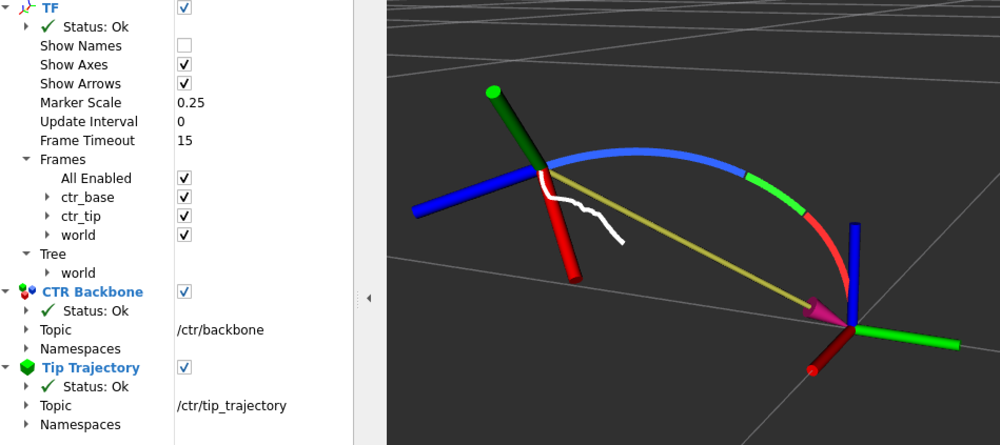
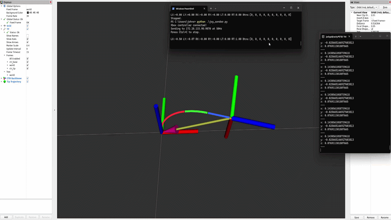

# ctr-sim

A Python and ROS 2 simulation framework for modeling, controlling, and teleoperating concentric tube robots (CTRs).



`ctr-sim` implements segment-aware mechanics for concentric tube robots together with numerical task-space control and real-time ROS 2 visualization. The simulator models tube geometry, elastic properties, torsional interaction, backbone curvature, and spatial backbone integration, then exposes the resulting robot through a Cartesian teleoperation interface.

An Xbox controller can be used to command the CTR tip in Cartesian space while the robot backbone, mechanics segments, coordinate frames, tip pose, and tip trajectory are visualized live in RViz.

> **Status:** Research/development software. The current implementation focuses on unloaded CTR mechanics, numerical resolved-rate control, and interactive simulation.

## Demo



The demo shows live Xbox-controller teleoperation of the CTR tip in RViz. Individual mechanics segments are rendered in distinct colors, the moving tip frame is published through TF, and the white line records the Cartesian tip trajectory.

## Features

### CTR modeling and mechanics

- Material definitions with Young's and shear moduli
- Tube geometry, length, diameter, precurvature, insertion, and rotation
- Multi-tube robot state representation
- Backbone segmentation at changing tube boundaries
- Segment-aware torsion solution
- Resultant backbone curvature computation
- Spatial backbone integration
- Dense continuous segment solutions
- Backbone sampling and direct tip-state evaluation
- Warm-started mechanics solves

### Cartesian control

- Numerical Cartesian position Jacobian
- Insertion and rotation finite differences
- Resolved-rate inverse kinematics
- Joint-step insertion constraints
- Cartesian velocity command watchdog
- Warm-started Jacobian mechanics
- Jacobian caching for faster interactive control

### ROS 2 teleoperation

- Xbox controller input
- Windows-to-WSL joystick bridge over UDP
- ROS 2 `sensor_msgs/Joy` publication
- Cartesian `geometry_msgs/Twist` commands
- CTR simulator ROS node
- Published tip pose
- Static `world -> ctr_base` transform
- Dynamic `ctr_base -> ctr_tip` transform
- One-command ROS 2 launch workflow

### Visualization

- Matplotlib backbone visualization
- RViz backbone visualization
- Distinct colors for mechanics segments
- TF frame visualization
- Live Cartesian tip trajectory
- Saved RViz configuration

### Testing and validation

- Automated tests with `pytest`
- Forward-mechanics validation against an independent MATLAB implementation
- Tests for robot geometry, segmentation, torsion, curvature, forward mechanics, sampling, Jacobians, resolved-rate control, and constraints
- Timing and Jacobian-reuse diagnostic examples

## System Architecture

```text
Xbox Controller
      |
      | XInput
      v
Windows joy_sender.py
      |
      | UDP
      v
ROS 2 joy_receiver
      |
      | /joy
      v
cartesian_teleop
      |
      | /ctr/cartesian_velocity
      v
ctr_simulator
      |
      +---- segment-aware CTR mechanics
      |
      +---- resolved-rate Cartesian control
      |
      +---- /ctr/backbone
      +---- /ctr/tip_pose
      +---- /ctr/tip_trajectory
      +---- /tf
      +---- /tf_static
               |
               v
              RViz
```

The Cartesian controller operates in the `ctr_base` frame. Controller inputs request Cartesian tip velocity along the X, Y, and Z axes of that frame.

## Mechanics

The V2 mechanics pipeline represents the backbone as a sequence of geometric/mechanics segments rather than treating the entire robot as one uniform interval.

Tube boundaries determine the backbone segmentation. Within each segment, the active tube set is fixed, allowing the torsional state and resultant curvature to be evaluated consistently with the local tube geometry.

The forward-mechanics pipeline is approximately:

```text
Robot configuration
      |
      v
Backbone segmentation
      |
      v
Segment-aware torsion solution
      |
      v
Segment curvature
      |
      v
Spatial backbone integration
      |
      v
Backbone / tip pose
```

The torsion problem is solved using a shooting formulation with continuation when required. Previous torsion solutions are reused as initial guesses during interactive operation, substantially reducing the cost of nearby mechanics solves.

## Cartesian Resolved-Rate Control

For robot configuration

```text
q = [beta_1 ... beta_n alpha_1 ... alpha_n]
```

the numerical position Jacobian approximates

```text
J(q) = d p_tip / d q
```

where the first set of columns corresponds to tube insertions and the second set corresponds to tube rotations.

Given a desired Cartesian displacement `dx`, the controller computes a joint-space increment using a pseudoinverse-based resolved-rate step:

```text
dq = J(q)^+ dx
```

Insertion constraints are then applied before updating the simulated robot configuration.

### Jacobian caching

Computing the numerical Jacobian is the primary computational bottleneck because each column requires an additional nonlinear forward-mechanics solve.

To improve interactive performance, the ROS simulator caches the current Jacobian and reuses it for several nearby control updates before recomputing it. Diagnostic experiments showed that the Jacobian changes gradually over small Cartesian motions, making short-term reuse useful for teleoperation.

On the development system, cached control iterations were substantially faster than iterations requiring a full Jacobian refresh. Exact performance depends on robot geometry and hardware.

## Controller Mapping

The current Xbox mapping is:

| Controller input | Cartesian command |
| --- | --- |
| Right trigger | Deadman / motion enable |
| Left stick left/right | `ctr_base` X |
| Left stick up/down | `ctr_base` Y |
| Right stick up/down | `ctr_base` Z |

The commanded motion is expressed in the **CTR base frame**, not the moving tip frame.

In RViz, the standard TF axis colors are:

- **X:** red
- **Y:** green
- **Z:** blue

## Installation

### Requirements

The current development environment uses:

- Python 3.10
- NumPy
- SciPy
- ROS 2 Humble
- RViz 2
- WSL/Ubuntu for the ROS 2 environment
- Windows for Xbox/XInput acquisition

The core Python mechanics library can be used independently of ROS 2.

### Clone the repository

```bash
git clone <https://github.com/JackyP1937/ctr-sim>
cd ctr-sim
```

### Create the Python environment

```bash
python3 -m venv .venv
source .venv/bin/activate
```

Install the core simulator in editable mode:

```bash
python3 -m pip install --no-build-isolation -e .
```

### Build the ROS 2 package

From the ROS workspace:

```bash
cd ros2_ws
colcon build --packages-select ctr_teleop
source install/setup.bash
```

## Running the ROS 2 Simulator

### Ubuntu / WSL

From `ros2_ws`:

```bash
source install/setup.bash
ros2 launch ctr_teleop ctr_sim.launch.py
```

The launch file starts:

- `joy_receiver`
- `cartesian_teleop`
- `ctr_simulator`
- RViz with the saved CTR visualization configuration

### Windows

Run the Xbox-controller sender:

```powershell
python windows\joy_sender.py
```

The Windows process reads the Xbox controller and sends joystick state over UDP to the ROS 2 receiver running under WSL.

Hold the **right trigger** to enable robot motion.

## ROS 2 Interfaces

Important topics include:

| Topic | Purpose |
| --- | --- |
| `/joy` | Xbox joystick state |
| `/ctr/cartesian_velocity` | Desired Cartesian tip velocity |
| `/ctr/backbone` | Colored backbone mechanics-segment markers |
| `/ctr/tip_pose` | Current CTR tip pose |
| `/ctr/tip_trajectory` | Historical tip trajectory marker |
| `/tf` | Dynamic transforms including `ctr_base -> ctr_tip` |
| `/tf_static` | Static `world -> ctr_base` transform |

For example, the live tip position can be inspected with:

```bash
ros2 topic echo /ctr/tip_pose --field pose.position
```

The dynamic tip transform can be inspected with:

```bash
ros2 run tf2_ros tf2_echo ctr_base ctr_tip
```

## RViz Visualization

The included RViz configuration displays:

- a reference grid;
- the CTR backbone;
- mechanics segments using distinct colors;
- the `world`, `ctr_base`, and `ctr_tip` TF frames; and
- an optional tip trajectory.

The **Tip Trajectory** display can be toggled directly from the RViz Displays panel.

## Python Examples

The `examples/` directory contains demonstrations and diagnostics for:

- materials and tube definitions;
- robot construction;
- coordinate transforms;
- backbone segmentation;
- torsion mechanics;
- forward kinematics;
- visualization;
- numerical Jacobians;
- resolved-rate control;
- teleoperation;
- MATLAB validation cases;
- mechanics timing; and
- Jacobian-reuse behavior.

For example:

```bash
python examples/timing_v3.py
```

benchmarks warm forward mechanics, backbone sampling, direct tip extraction, and cold/warm numerical Jacobian computation.

## Testing

Run the test suite from the repository root:

```bash
PYTEST_DISABLE_PLUGIN_AUTOLOAD=1 pytest tests -v
```

The test suite covers both the original mechanics implementation and the newer segment-aware V2 pipeline.

## Repository Structure

```text
ctr-sim/
|
+-- ctr_sim/
|   +-- control/          # Jacobians, resolved-rate control, constraints
|   +-- kinematics/       # Intervals and transformations
|   +-- mechanics/        # Torsion, curvature, integration, forward solves
|   +-- visualization/    # Python plotting utilities
|   +-- robot.py
|   +-- tube.py
|   +-- state.py
|   +-- segment.py
|   +-- backbone.py
|   +-- ...
|
+-- ros2_ws/
|   +-- src/
|       +-- ctr_teleop/   # ROS 2 teleoperation/simulation package
|
+-- windows/
|   +-- joy_sender.py     # Windows Xbox-controller sender
|
+-- examples/             # Examples, validation cases, and timing diagnostics
+-- tests/                # Automated test suite
+-- docs/                 # Design notes, roadmap, and media
+-- pyproject.toml
+-- README.md
```

## Known Limitations

- The current mechanics model focuses on unloaded CTR behavior; external contact and distributed environmental loads are not modeled.
- The numerical Jacobian requires multiple nonlinear forward solves and remains computationally expensive.
- Jacobian caching improves interactive performance but means some control updates use a Jacobian evaluated at a nearby configuration.
- The torsion shooting/continuation solver is not guaranteed to converge for arbitrary robot geometries or all finite-difference perturbations.
- Joint constraints are currently enforced by constraining the resolved-rate joint step rather than solving a fully constrained inverse-kinematics optimization.
- The Windows Xbox bridge is currently separate from the ROS 2 launch process.

## Future Work

Potential extensions include:

- constraint-aware inverse kinematics;
- asynchronous Jacobian computation;
- ROS-parameter-based configuration;
- joint-state publication;
- external loading and contact;
- additional CTR mechanics validation;
- higher-performance Jacobian computation; and
- hardware integration.

## Documentation

Additional development notes are available in:

- [`docs/design.md`](docs/design.md)
- [`docs/roadmap.md`](docs/roadmap.md)
